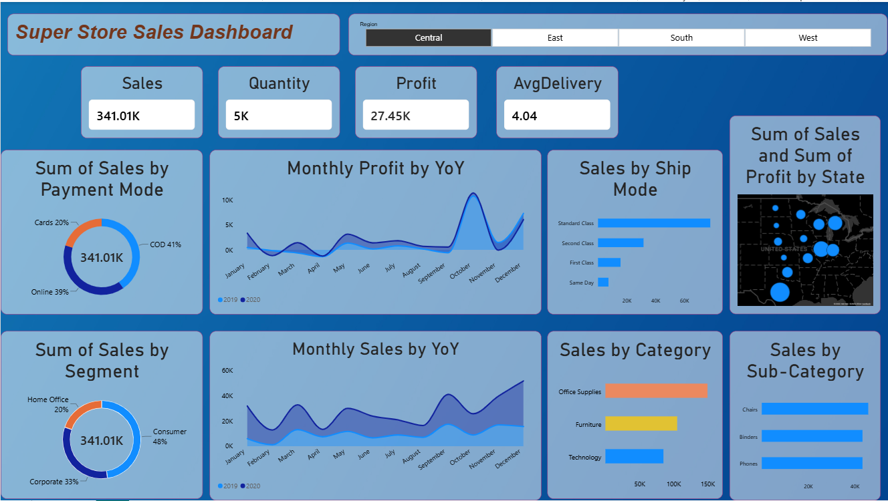
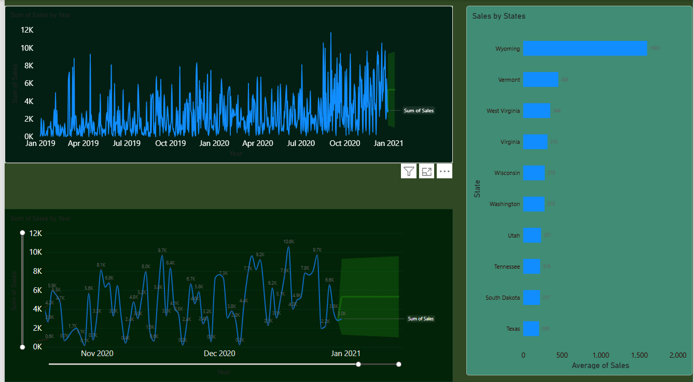

# Superstore-sales-dashboard

🛒 SuperStore Sales Dashboard & Forecasting

An end-to-end data analytics project analysing 2 years of US retail sales data — combining exploratory analysis, time series forecasting, and an interactive Power BI dashboard to deliver actionable business insights.

📊 Live Dashboard

Built in Power BI — featuring dynamic filters, regional breakdowns, KPI cards, and a 15-day sales forecast using time series analysis.

📌 Project Overview

Retail businesses generate enormous volumes of transactional data every day. The challenge isn't collecting it — it's turning it into decisions. This project does exactly that: takes 2 years of raw SuperStore sales records and builds a complete analytics solution that answers the questions a business actually cares about:

Where are we making money — and where are we losing it?
Which products, regions, and customer segments drive the most revenue?
How will sales trend over the next 15 days?
What payment and shipping patterns should the business act on?
📁 Dataset

5,901 transactions across 2019–2020, covering retail sales across the United States.

Property	Value
Time period	January 2019 – December 2020
Total transactions	5,901
Total orders	3,003
Unique customers	773
States covered	49
Total revenue	$1,565,804
Total profit	$175,262

Features include: Order date, ship date, ship mode, customer segment, region, product category, sub-category, sales, quantity, profit, returns, and payment method.

📈 Key Insights
💰 Revenue & Profitability
Total sales of $1.57M generated a profit of $175K — an overall margin of ~11.2%
Technology products contributed the highest profit margin despite ranking second in total sales
Furniture had the lowest profit-to-sales ratio, suggesting pricing or cost issues worth investigating
🗂 Category Performance
Category	Sales
Office Supplies	$643,708 (41%)
Technology	$470,588 (30%)
Furniture	$451,509 (29%)
🏆 Top Sub-Categories
Phones — $196,564
Chairs — $181,946
Binders — $174,978
🗺 Regional Breakdown
Region	Sales
West	$522,441
East	$450,235
Central	$341,008
South	$252,121

The West region leads in revenue, while the South presents a growth opportunity with the lowest contribution.

👥 Customer Segments
Segment	Sales
Consumer	$753,002 (48%)
Corporate	$509,743 (33%)
Home Office	$303,059 (19%)

Consumers dominate purchases, but Corporate customers offer higher average order values worth targeting for retention.

🚚 Shipping Preferences
Standard Class is the most used shipping mode
Same Day delivery remains the least used — potential opportunity to promote for premium customers
💳 Payment Methods
COD (Cash on Delivery) — 2,453 transactions (42%)
Online — 2,164 transactions (37%)
Cards — 1,284 transactions (21%)

The high COD usage indicates an opportunity to incentivise digital payments and reduce fulfilment complexity.

🔮 Sales Forecasting

Applied time series analysis on monthly sales data to generate a 15-day forward forecast. The forecast helps the business:

Plan inventory levels in advance
Allocate staffing and logistics resources
Identify seasonal patterns and demand peaks
🛠 Tools Used
Tool	Purpose
Power BI	Interactive dashboard and visualisations
Time Series Analysis	15-day sales forecasting
Excel / CSV	Raw data storage and preparation
DAX	Calculated measures and KPIs in Power BI
📂 Files in This Repository
## 📂 Files in This Repository

| File | Description |
|---|---|
| [SuperStore_Sales_DataSet.csv](SuperStore_Sales_DataSet.csv) | Raw transactional sales data (2019–2020) |
| [Sales Overview](Sales_Dashboard.png)
| [Sales Forecast](Sales_Forecast.png) | Power BI dashboard images|
| [README.md](README.md) | Project documentation |
💡 Business Recommendations

Based on the analysis:

Focus retention efforts on West and East regions — they drive 62% of total revenue
Invest in Technology upselling — highest profit margins across categories
Target Corporate segment with loyalty programmes — strong revenue base with growth potential
Review Furniture pricing strategy — lowest margin category despite significant sales volume
Promote digital payment options — reduce COD dependency to streamline operations
Leverage the 15-day forecast for proactive inventory and staffing decisions
👩‍💻 About Me

Snehika | Aspiring Data Analyst

This project is part of my data analytics portfolio, demonstrating skills in data cleaning, exploratory analysis, business insight generation, time series forecasting, and interactive dashboard design.

📫 Open to Data Analyst opportunities — feel free to connect! 
## 📫 Let's connect
- 🔗 [LinkedIn](www.linkedin.com/in/snehika-amudalapalli)
- 📧 [youremail@gmail.com](mailto:snehikaamudalapalli2002@gmail.com)
